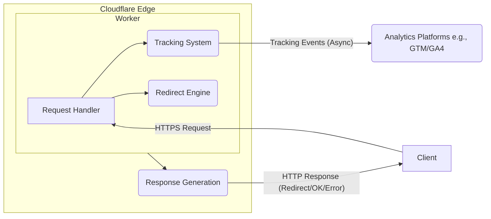

# Technical Architecture and Design Documentation

This document serves as the main entry point for the technical design of the URL Redirector service. The detailed design aspects are split into separate documents linked below.

## Overview

The service is a Cloudflare Worker designed to act as a central hub for URL redirection and tracking parameter collection. It intercepts requests containing a destination URL in the hash fragment, extracts tracking parameters, sends them to analytics platforms, and then redirects the user to the final destination URL.

## Architecture Diagram

(See [Architecture Overview](./architecture_overview.md) for more details)

## Design Documents

*   **[Infrastructure](./infrastructure.md):** Details on the underlying Cloudflare platform components used.
*   **[Core URL Processing Mechanism](./url_processing.md):** Explanation of how the specific URL structure (`#` fragment) is handled.
*   **[System Architecture Overview](./architecture_overview.md):** High-level static view of the system components and characteristics.
*   **[Component Interaction and Contracts](./component_interactions.md):** Dynamic view of how components interact, including sequence diagrams.
*   **[Component Design Documents](./component_designs.md):** Detailed internal logic for the Request Handler, Tracking System, and Redirect Engine.
*   **[API Specifications (Internal)](./api_specifications.md):** Internal function signatures and data structures used between components.
*   **[Integration Designs](./integration_designs.md):** How the service integrates with external analytics platforms (GTM, GA4).
*   **[Security Design](./security_design.md):** Security considerations, validation, and mitigation strategies.
*   **[Future Design Considerations](./future_considerations.md):** Items for future work or potential enhancements, including Data Models.

## Related Documents
- [Product Overview](../specs/product_requirements/overview.md)
- [Functional Requirements](../specs/product_requirements/functional_requirements.md)
- [Non-Functional Requirements](../specs/product_requirements/non_functional_requirements.md)

### Core Documentation
- Product requirements in [specs directory](../specs/SPECS.md)
- Project planning in [project-plan directory](../project-plan/PLAN.md)
- Research findings in [research directory](../research/README.md)

### Implementation Resources
- Setup guides in [setup directory](../setup/README.md)
- User documentation in [user directory](../user/README.md)
- Additional technical notes in [misc directory](../misc/README.md)