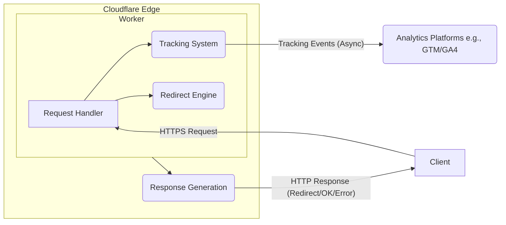

## System Architecture Overview

The system is deployed as a single Cloudflare Worker running on the edge network. This worker encapsulates all three core components.

**Key Characteristics:**
- **Stateless:** The core redirection logic is stateless, relying only on the incoming URL.
- **Edge Deployment:** Leverages Cloudflare's global network for low latency.
- **Single Worker:** Simplifies deployment and management, containing all logic.
- **Asynchronous Tracking:** Tracking events are typically sent asynchronously to avoid delaying the user redirection. 