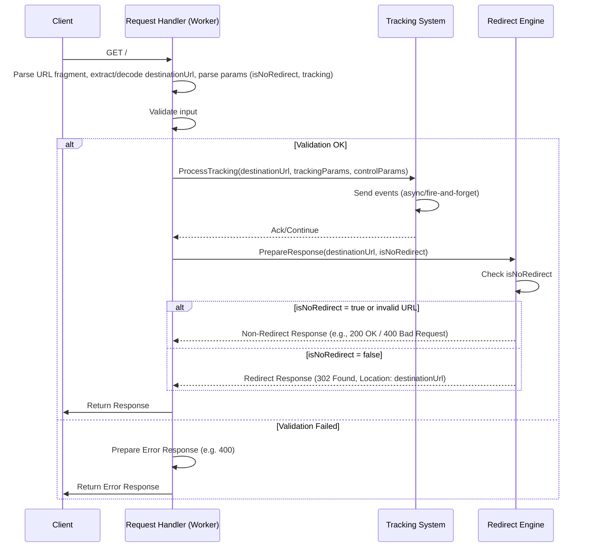

## Component Interaction and Contracts

The primary workflow involves the Request Handler coordinating calls to the Tracking System and then the Redirect Engine.

1.  **Request Arrival:** User request hits the Cloudflare Worker endpoint.
2.  **Request Handler:**
    *   **Input:** Cloudflare `Request` object.
    *   **Processing:** Parses URL fragment (`#`), extracts/decodes `destination_url`, parses control and tracking parameters from `destination_url`'s query string, performs validation.
    *   **Contract (to Tracking System):** Passes `{ destinationUrl: string, trackingParams: object, controlParams: object }`.
    *   **Contract (to Redirect Engine):** Passes `{ destinationUrl: string, isNoRedirect: boolean }`.
    *   **Action:** Calls Tracking System, then Redirect Engine if valid. Prepares error `Response` if validation fails.
3.  **Tracking System:**
    *   **Input:** Data object from Request Handler.
    *   **Processing:** Validates parameters, formats data, sends tracking events (likely async fire-and-forget), logs activity.
    *   **Output:** Returns control quickly.
4.  **Redirect Engine:**
    *   **Input:** Data object from Request Handler (`destinationUrl`, `isNoRedirect`).
    *   **Processing:** Checks `isNoRedirect`. Prepares 302 Redirect `Response` or a non-redirect `Response` (e.g., 200 OK, 400 Bad Request) based on the flag and URL validity.
    *   **Output:** Cloudflare `Response` object.
5.  **Response:** Request Handler returns the final `Response` to the client.

### Sequence Diagram

